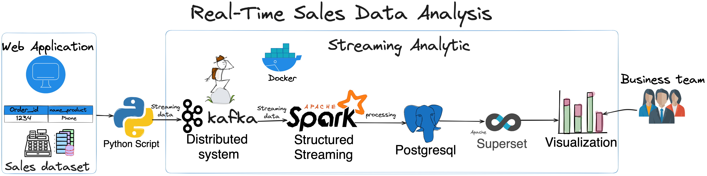
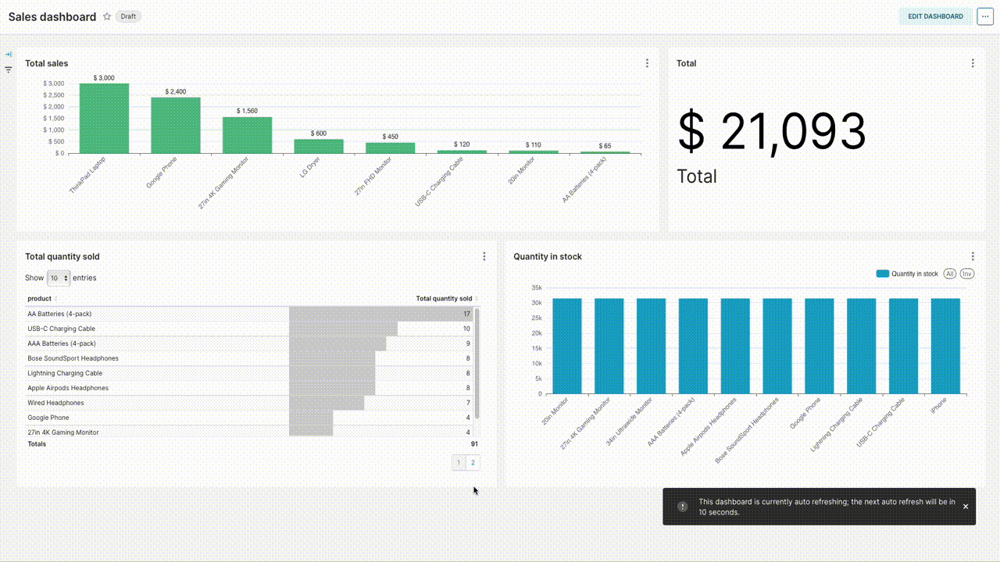

# Transforming Sales Insights: Real-Time Data Analysis with Kafka, Spark, PostgreSQL, Docker and Apache Superset

A Real-Time Sales Data Analysis application harnesses <b>Kafka</b> as a messaging system, <b>Spark</b> to processes and analyzes streaming data, <b>Docker</b> to build environment, <b>PostgreSQL</b> to store processed data Superset to transform raw sales data into actionable business intelligence.

<p align="center">
  
</p>

## The Challenge: Manual Record-Keeping Problem

Our retail operations struggled with a <b>manual record-keeping system</b>, making it difficult to <b>track sales trends</b>, <b>identify top-selling products</b>, and <b>manage stock levels efficiently</b>. 

This led to overstocking and understocking, impacting profits. <b>The Real-Time Sales Data Analysis application</b> emerged as a transformative solution, addressing these critical challenges.

## Main Tasks:

The project aims to answer key questions through real-time data analysis:

- What is the monthly and yearly sales performance?
- Which products consistently yield the highest sales?
- How can sales trends be analyzed monthly?
- What stocks are running low, and when should they be added?

## Getting Started

###  Project file:

- `prepare_data.py`: [prepare_data.py](prepare_data.py) is created to clean the raw sales data, ensuring its quality for streaming and analysis.

- `setup_sales_db.py`: [setup_sales_db.py](setup_sales_db.py) is created to create sales database schema for stock and sales in PostgreSQL.

- `produce_sales_data.py`: [produce_sales_data.py](produce_sales_data.py) is responsible for streaming data to the `sales` topic in Kafka.

- `spark_streaming_etl.py`: [spark_streaming_etl.py](spark_streaming_etl.py) sets up the logger, initializes the Spark Session, defines configuration parameters, and calls the `process_data` function to execute the ETL process.

### 👟 Running Project:

1- Clone the repository:

```
git clone https://github.com/ntd284/Application_of_sales_analysis.git
```

2- Navigate to the project directory

```
cd Application_of_sales_analysis
```

3- Install the needed packages and libraries:

```
pip3 install -r ./requirements.txt
```

3- Install Docker, Docker compose:

```
sudo ./installdocker.sh
docker --version
docker compose version
```

4- Build docker:

```
docker compose up -d
```

5- Run step by step files:

```
python3 prepare_data.py
python3 setup_sales_db.py
python3 spark_streaming_etl.py
python3 produce_sales_data.py
```

### Dashboard Demo

Check out a brief demo of Sales dashboard: at `http://localhost:8088`

<p align="center">
  
</p>

### Reference:

[1]. Alaa haggag(Nov 26, 2023)[ Real-Time Sales Data Analysis Application: Leveraging Kafka, Spark, Airflow, and Apache superset ](https://medium.com/@alaahgag34/real-time-sales-data-analysis-application-leveraging-kafka-spark-airflow-and-apache-superset-f7db6a31823a)

[2]. Nguyen Truong(May 9, 2022)[ Xây dựng mô hình Real-time Analytic](https://www.linkedin.com/pulse/xây-dựng-mô-hình-real-time-analytic-nguyen-truong/)

<b> ⚡️⚡️That's all for my project, thanks for watching. If you have any question, don't hesitate inbox me. ⚡️⚡️</b>
