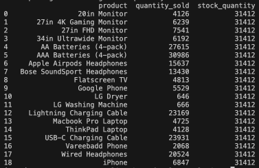
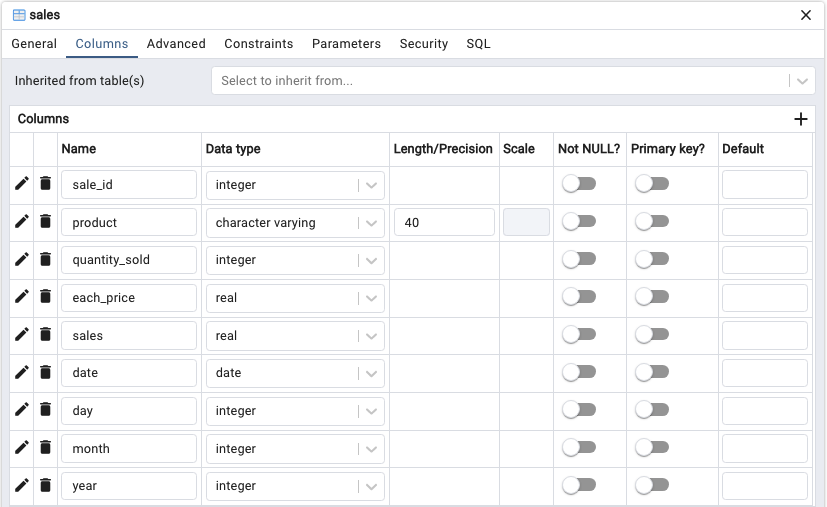
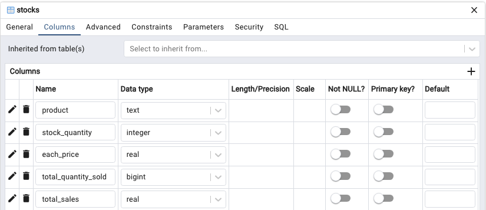

# Transforming Sales Insights: Real-Time Data Analysis with Kafka, Spark, PostgreSQL, Docker and Apache Superset

A Real-Time Sales Data Analysis application harnesses <b>Kafka</b> as a messaging system, <b>Spark</b> to processes and analyzes streaming data, <b>Docker</b> to build environment, <b>PostgreSQL</b> to store processed data Superset to transform raw sales data into actionable business intelligence.

  

## The Challenge: Manual Record-Keeping Problem

Our retail operations struggled with a <b>manual record-keeping system</b>, making it difficult to <b>track sales trends</b>, <b>identify top-selling products</b>, and <b>manage stock levels efficiently</b>. 

This led to overstocking and understocking, impacting profits. <b>The Real-Time Sales Data Analysis application</b> emerged as a transformative solution, addressing these critical challenges.

## Main Tasks:

The project aims to answer key questions through real-time data analysis:

- What is the monthly and yearly sales performance?
- Which products consistently yield the highest sales?
- How can sales trends be analyzed monthly?
- What stocks are running low, and when should they be added?

## Project Workflow

1. Data ingestion:

To simulate product checkouts, [Sales_Dataset](Datasource) will be used in the Kafka producer.

2. Data preparation: [prepare_data.py](prepare_data.py) 

Dataset will be cleaned and processed to ensure quality of data before producing. Two main datasets will be used:

- Sales table: store sessions of sales

  

- Stocks tables: store the total of product quantity in stocks

  

3. Streaming data to Data Warehouse : 

3.1. Build schema in Data Warehouse (PostgreSQL): [setup_sales_db.py](setup_sales_db.py)

- Sales table: store sessions of sales in PostgreSQL

  

- Stocks table: store the total of product quantity in stocks in PostgreSQL

  

